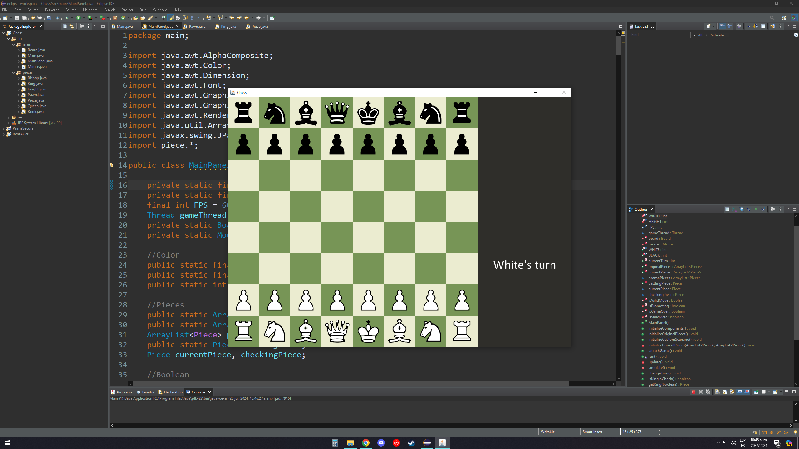
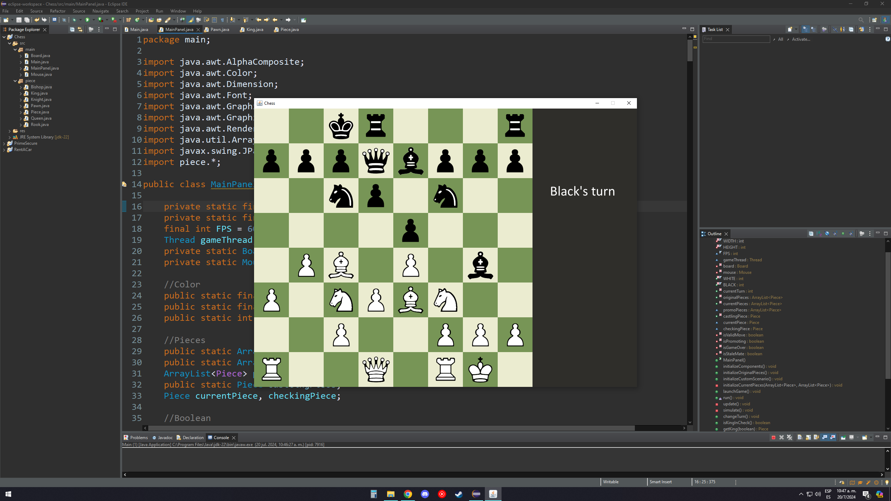
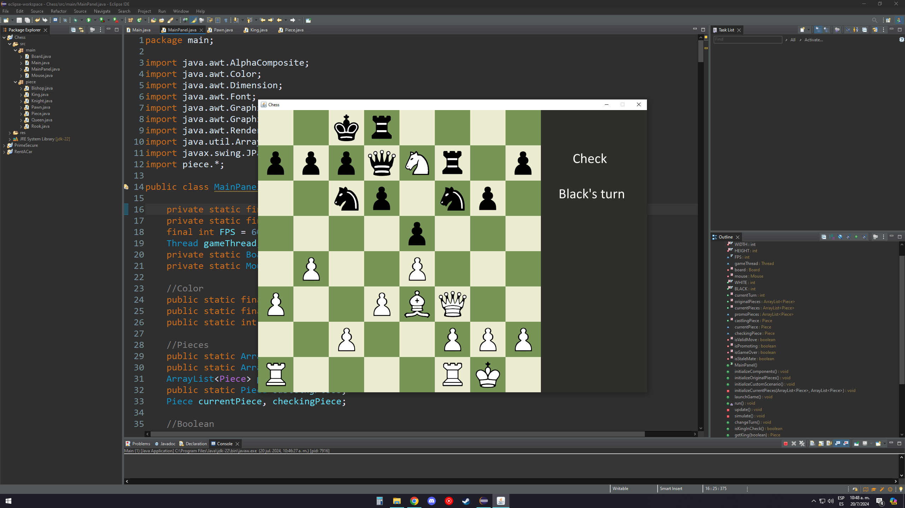
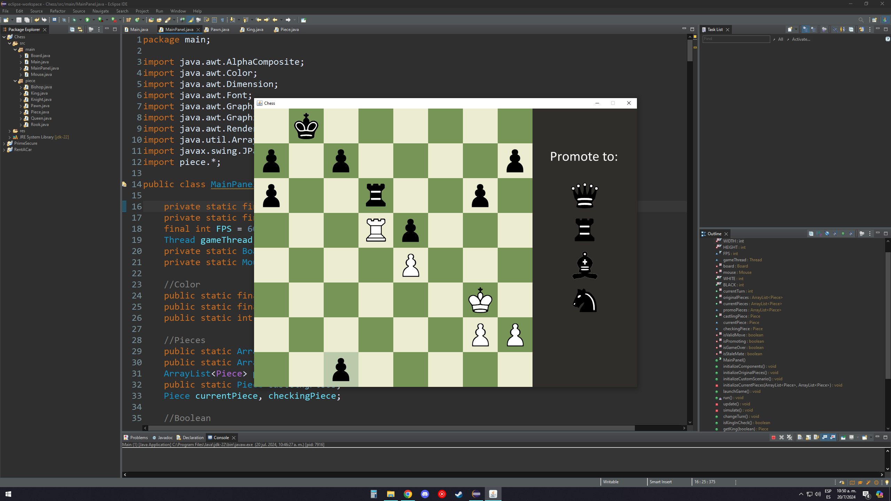
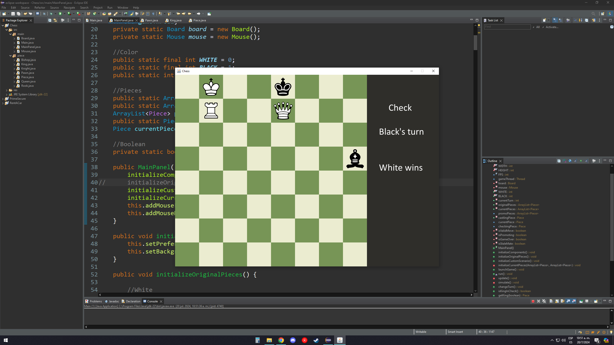
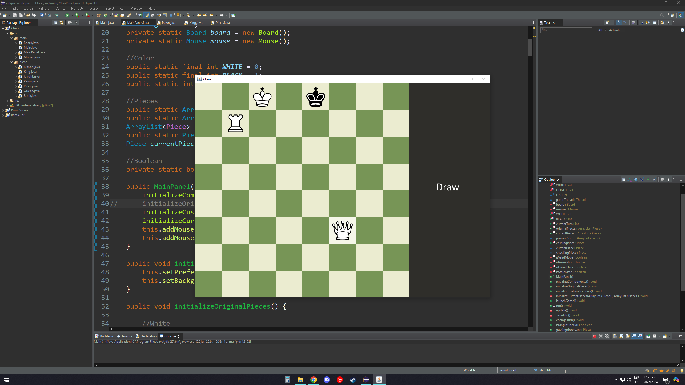

# Chess
Classic chess game, take turns in this strategy battle to checkmate your opponent

## Built with:
Java

## Features:
- Capture, castling, en passant, check, checkmate and stalemate are playable moves
- Each piece has it's own set of moves
- In-game messages of the current state of the game
- Default 60 FPS experience, can be modified in main.MainPanel

## How to use:
1. Install java
2. Run the program

## Credits:
Julio Salazar